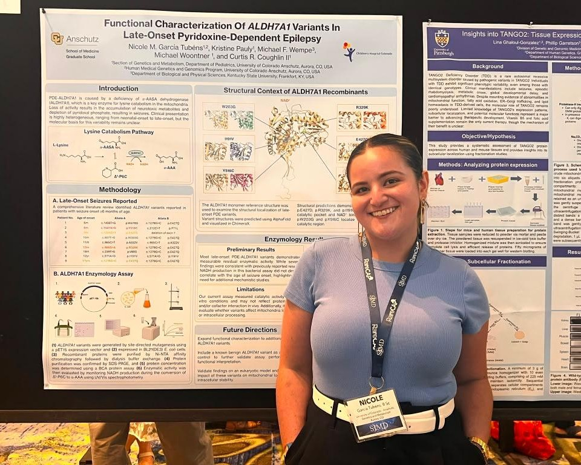

We attended the annual Society of Inherited Metabolic Disorders (SIMD) meeting in Rio Grande, Puerto Rico.  It was amazing to reconnect with colleagues, friends, and patient advocacy partners. 

 Kristie presented our recent paper on Newborn screening for PDE during the first full day of the meeting, and it was a highlight of the entire meeting! 

 Kristie received the [Emmanual Shapira Award](/blog/shapira) from Deb Regier, MD, PhD (President of SIMD) and Kristi Wees (Executive Director). This is the second Emmanual Shapira Award bestowed on our laboratory for work focused on PDE-ALDH7A1, and we are excited to hang both awards in the lab.   

 Nicole presented two posters at the meeting:  "Functional Characterization Of ALDH7A1 Variants in Late-Onset Pyridoxine-Dependent Epilepsy," is a result of her work in the Coughlin Lab. 

And a second poster on "Deep Intronic Variants as a Cause of OTC Deficiency," which was a collaboration with Drs. Shawn McCandless (pictured), [Sujatha Jagannathan](https://www.jagannathan-lab.org/), and Tamim Shaikh. 

 Nicole also participated in an outreach to undergraduate students at the University of Puerto Rico. For the last few years, members of SIMD have organized a similar outreach to discuss careers pathways in rare diseases, genetics, and inborn errors of metabolism. 

